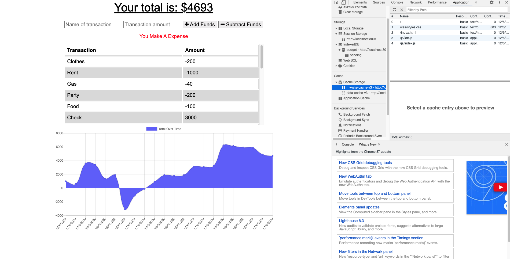
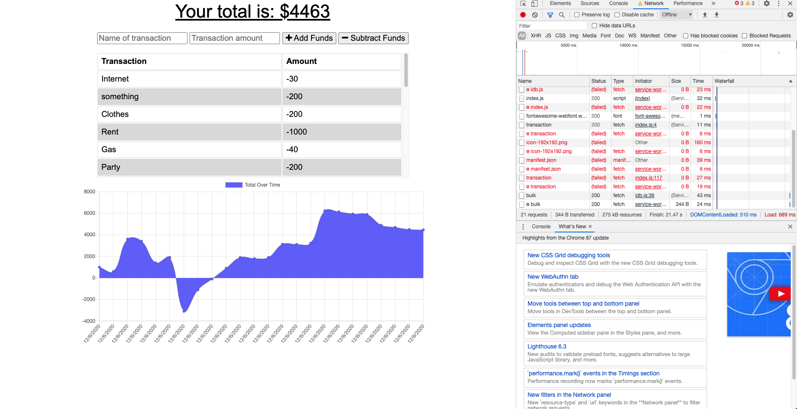

## Progressive Web Applications - Budget Tracker

Giving users a fast and easy way to track their money is important, but allowing them to access that information at any time is even more important. Having offline functionality is paramount to the success of an application that handles users’ financial information.

GIVEN a budget tracker without an internet connection

- WHEN the user inputs an expense or deposit
- THEN they will receive a notification that they have added an expense or deposit
- WHEN the user reestablishes an internet connection
- THEN the deposits or expenses added while they were offline are added to their transaction history and their totals are updated

## Deployed Application

## Mock-Up

- Online
  
- Offline
  
